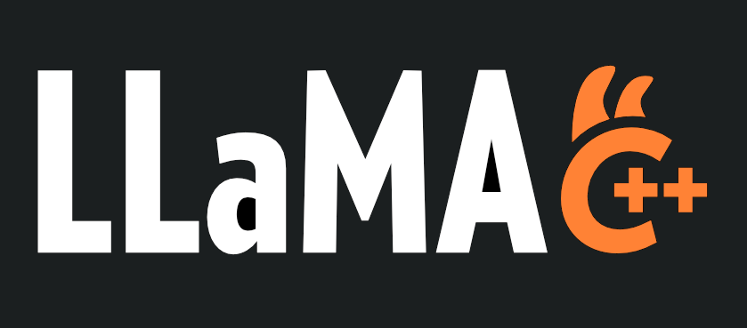
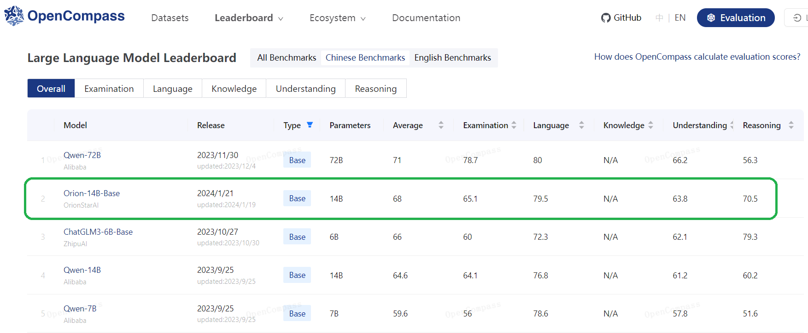
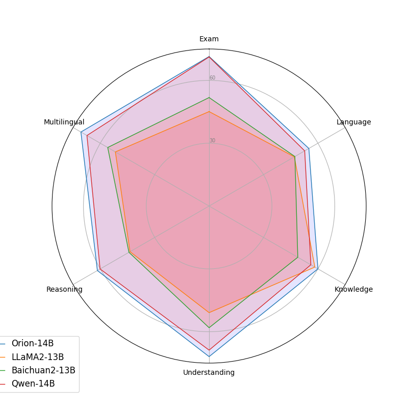

<!-- markdownlint-disable first-line-h1 -->
<!-- markdownlint-disable html -->
<div align="center">
  
</div>

<div align="center">
<h1>
  Orion-14B
</h1>
</div>

<div align="center">

<div align="center">
     <b>🇰🇷한국어</b> | <a href="./README.md">🌐英語</a> | <a href="./README_zh.md">🇨🇳中文</a> | <a href="./README_ja.md">🇯🇵日本語</a>
</div>

<h4 align="center">
    <p>
        🤗 <a href="https://huggingface.co/OrionStarAI" target="_blank">HuggingFace홈페이지</a> | 🤖 <a href="https://modelscope.cn/organization/OrionStarAI" target="_blank">ModelScope홈페이지</a><br>🎬 <a href="https://huggingface.co/spaces/OrionStarAI/Orion-14B-App-Demo" target="_blank">HuggingFace온라인 시용</a> | 🎫 <a href="https://modelscope.cn/studios/OrionStarAI/Orion-14B-App-Demo/summary" target="_blank">ModelScope在线试用</a><br>😺 <a href="https://github.com/OrionStarAI/Orion" target="_blank">GitHub</a><br>📖 <a href="https://github.com/OrionStarAI/Orion/blob/master/doc/Orion14B_v3.pdf" target="_blank">기술 리포트</a>
    <p>
</h4>

</div>


# 목록

- [📖 모형 소개](#model-introduction)
- [🔗 다운로드 경로](#model-download)
- [🔖 평가결과](#model-benchmark)
- [📊 모형 추리](#model-inference) [](#vllm) [](#llama-cpp)
- [📜 성명 합의](#declarations-license)
- [🥇 기업 소개](#company-introduction)


<a name="model-introduction"></a><br>
# 1. 모델소게


-Orion-14B-Base는 2.5조 토큰의 다양한 데이터 집합으로 훈련된 140억 개의 파라메터를 가진 다중 언어 모델이다. 중국어, 영어, 일본어, 한국어 및 기타 언어를 포함한다.다중 언어 환경에서 일련의 업무에서 탁월한 성능을 보인다. Orion-14B 시리즈의 모델들은 주요 공개 기준 측정에서 우수한 성적을 거두었으며 여러가지 지표가 동일한 파라메터를 가진 다른 모델들을 현저히 초월한다. 구체적인 기술 디테일은 [기술보고서]를 참고하세요.
(https://github.com/OrionStarAI/Orion/blob/master/doc/Orion14B_v3.pdf)。

- Orion-14B시리즈 대형 모델은 다음과 같은 특징이 있다.
  - 베이스20B 파라메터 레벨인 대형 모델의 종합적인 평가 결과가 우수하다
  - 다국어 능력이 뛰어나고 일본어와 한국어 테스트 세트에서 현저히 앞선다
  - 미세조정 모델은 적응성이 강하며 인위 표시의 블라인드 테스트에서 활약이 두드러진다
  - 긴 컨텍스트 버전은 최대 320k까지 지원하는 200k 토큰에 뛰어난 긴 텍스트를 지지한다
  - 정량화 버전 모델 크기를 70% 줄이고 추론 속도를 30% 높이며 성능 손실을 1% 미만하다
 <table style="border-collapse: collapse; width: 100%;">
   <tr>
     <td style="border: none; padding: 10px; box-sizing: border-box;">
       
     </td>
     <td style="border: none; padding: 10px; box-sizing: border-box;">
       
     </td>
   </tr>
 </table>

- 구체적으로 말하면 Orion-14B시리즈 대형 언어 모델은 다음과 같은 내용을 포함한다:
  - **Orion-14B-Base:** 2.5억 토켄스 다양화 데이터 세트를 기반으로 한 140억 파라메터 규모의 다언어 기반 모델.
  - **Orion-14B-Chat:** 고퀄리티 코퍼스 미세조정을 기반으로 한 대화형 모델. 대형 모델 커뮤니티를 위해 더 나은 사용자 인터랙션 경험을 제공하도록 한다.
  - **Orion-14B-LongChat:** 200k 토큰 길이에 효과적이며 최대 320k까지 지원하며 긴 텍스트 평가 세트에서 독점 모델과 비교할 수 있다.
  - **Orion-14B-Chat-RAG:** 맞춰 제정된 검색 향상 생성 데이터 세트에서 미세조정하여 검색 향상 생성 작업에서 뛰어난 성능을 제공한 채팅 모델.
  - **Orion-14B-Chat-Plugin:** 플러그인 및 함수 전용 작업에 맞춰 제정된 채팅 모델. 에이전트와 관련된 상황에 아주 잘 적용되어 대형 언어 모델이 플러그인 및 함수 전용 시스템의 역할을 한다.
  - **Orion-14B-Base-Int4:** int4로 계량화하는 베이스 모델. 모델 크기를 70%를 줄이며 추리 속도를 30% 높여 1%의 최소한의 성능 손실만 가져왔다.
  - **Orion-14B-Chat-Int4:** int4로 계량화하는 대화 모델.


<a name="model-download"></a><br>
# 2. 다운로드 경로

발표된 모델 및 다운로드 링크는 다음 표를 참조하세요:

| 모델 명칭              | HuggingFace다운로드 링크                                                              | ModelScope다운로드 링크                                                                              |
|---------------------|-----------------------------------------------------------------------------------|------------------------------------------------------------------------------------------------|
| ⚾ 베이스 모델           | [Orion-14B-Base](https://huggingface.co/OrionStarAI/Orion-14B-Base)               | [Orion-14B-Base](https://modelscope.cn/models/OrionStarAI/Orion-14B-Base/summary)              |
| 😛 대화 모델           | [Orion-14B-Chat](https://huggingface.co/OrionStarAI/Orion-14B-Chat)               | [Orion-14B-Chat](https://modelscope.cn/models/OrionStarAI/Orion-14B-Chat/summary)              |
| 📃 긴 컨텍스트 모델        | [Orion-14B-LongChat](https://huggingface.co/OrionStarAI/Orion-14B-LongChat)       | [Orion-14B-LongChat](https://modelscope.cn/models/OrionStarAI/Orion-14B-LongChat/summary)      |
| 🔎 검색 향상 모델        | [Orion-14B-Chat-RAG](https://huggingface.co/OrionStarAI/Orion-14B-Chat-RAG)       | [Orion-14B-Chat-RAG](https://modelscope.cn/models/OrionStarAI/Orion-14B-Chat-RAG/summary)      |
| 🔌 플러그인 모델         | [Orion-14B-Chat-Plugin](https://huggingface.co/OrionStarAI/Orion-14B-Chat-Plugin) | [Orion-14B-Chat-Plugin](https://modelscope.cn/models/OrionStarAI/Orion-14B-Chat-Plugin/summary)|
| 💼 베이스Int4계량화 모델    | [Orion-14B-Base-Int4](https://huggingface.co/OrionStarAI/Orion-14B-Base-Int4)     | [Orion-14B-Base-Int4](https://modelscope.cn/models/OrionStarAI/Orion-14B-Base-Int4/summary)    |
| 📦 대화Int4계량화 모델    | [Orion-14B-Chat-Int4](https://huggingface.co/OrionStarAI/Orion-14B-Chat-Int4)     | [Orion-14B-Chat-Int4](https://modelscope.cn/models/OrionStarAI/Orion-14B-Chat-Int4/summary)    |


<a name="model-benchmark"></a><br>
# 3. 평가 결과

## 3.1. 베이스 모델Orion-14B-Base평가

### 3.1.1. 전문 지식 및 시험문제 평가 결과
| 모델 명칭            | C-Eval   | CMMLU    | MMLU     | AGIEval  | Gaokao   | BBH      |
|--------------------|----------|----------|----------|----------|----------|----------|
| LLaMA2-13B         |   41.4   |   38.4   |   55.0   |   30.9   |   18.2   |   45.6   |
| Skywork-13B        |   59.1   |   61.4   |   62.7   |   43.6   |   56.1   |   48.3   |
| Baichuan2-13B      |   59.0   |   61.3   |   59.5   |   37.4   |   45.6   |   49.0   |
| QWEN-14B           |   71.7   |   70.2   |   67.9   |   51.9   | **62.5** |   53.7   |
| InternLM-20B       |   58.8   |   59.0   |   62.1   |   44.6   |   45.5   |   52.5   |
| **Orion-14B-Base** | **72.9** | **70.6** | **69.9** | **54.7** |   62.1   | **56.5** |

### 3.1.2. 이해 및 통식 평가 결과
| 모델 명칭            |RACE-middle|RACE-high| HellaSwag| PIQA     | Lambada  | WSC      |
|--------------------|----------|----------|----------|----------|----------|----------|
| LLaMA 2-13B        |   63.0   |   58.9   |   77.5   |   79.8   |   76.5   |   66.3   |
| Skywork-13B        |   87.6   |   84.1   |   73.7   |   78.3   |   71.8   |   66.3   |
| Baichuan 2-13B     |   68.9   |   67.2   |   70.8   |   78.1   |   74.1   |   66.3   |
| QWEN-14B           |   93.0   |   90.3   | **80.2** |   79.8   |   71.4   |   66.3   |
| InternLM-20B       |   86.4   |   83.3   |   78.1   | **80.3** |   71.8   |   68.3   |
| **Orion-14B-Base** | **93.2** | **91.3** |   78.5   |   79.5   | **78.8** | **70.2** |

### 3.1.3. OpenCompass평가 세트 평가 결과
| 모델 명칭 | Average | Examination | Language | Knowledge | Understanding | Reasoning |
|------------------|----------|----------|----------|----------|----------|----------|
| LLaMA 2-13B      |   47.3   |   45.2   |   47.0   |   58.3   |   50.9   |   43.6   |
| Skywork-13B      |   53.6   |   61.1   |   51.3   |   52.7   |   64.5   |   45.2   |
| Baichuan 2-13B   |   49.4   |   51.8   |   47.5   |   48.9   |   58.1   |   44.2   |
| QWEN-14B         |   62.4   |   71.3   |   52.67  |   56.1   |   68.8   |   60.1   |
| InternLM-20B     |   59.4   |   62.5   |   55.0   | **60.1** |   67.3   |   54.9   |
|**Orion-14B-Base**| **64.3** | **71.4** | **55.0** |   60.0   | **71.9** | **61.6** |

### 3.1.4. 일본어 테스트 세트 평가 결과
|   모델 명칭         |**Average**|  JCQA    |  JNLI    |  MARC    |  JSQD   |  JQK     |  XLS     |  XWN     |  MGSM    |
|--------------------|----------|----------|----------|----------|----------|----------|----------|----------|----------|
| PLaMo-13B          |   52.3   |   56.7   |   42.8   |   95.8   |   70.6   |   71.0   |   8.70   |   70.5   |   2.40   |
| WebLab-10B         |   50.7   |   66.6   |   53.7   |   82.1   |   62.9   |   56.2   |   10.0   |   72.0   |   2.40   |
| ELYZA-jp-7B        |   48.8   |   71.7   |   25.3   |   86.6   |   70.8   |   64.1   |   2.50   |   62.1   |   7.20   |
| StableLM-jp-7B     |   51.1   |   33.4   |   43.3   | **96.7** |   70.6   |   78.1   |   10.7   |   72.8   |   2.80   |
| LLaMA 2-13B        |   46.3   |   75.0   |   47.6   |   38.8   |   76.1   |   67.7   |   18.1   |   63.2   |   10.4   |
| Baichuan 2-13B     |   57.1   |   73.7   |   31.3   |   91.6   |   80.5   |   63.3   |   18.6   |   72.2   |   25.2   |
| QWEN-14B           |   65.8   |   85.9   |   60.7   |   97.0   |   83.3   |   71.8   |   18.8   |   70.6   |   38.0   |
| Yi-34B             |   67.1   |   83.8   |   61.2   |   95.2   | **86.1** |   78.5   | **27.2** |   69.2   |   35.2   |
| **Orion-14B-Base** | **69.1** | **88.2** | **75.8** |   94.1   |   75.7   | **85.1** |   17.3   | **78.8** | **38.0** |

### 3.1.5. 한국어 테스트 세트n-shot평가 결과
| 모델 명칭  | **Average**<br>n=0&nbsp;&nbsp;n=5 | HellaSwag<br>n=0&nbsp;&nbsp;n=5 | COPA<br> n=0&nbsp;&nbsp;n=5 | BooIQ<br>n=0&nbsp;&nbsp;n=5 | SentiNeg<br>n=0&nbsp;&nbsp;n=5|
|------------------|------------------------------|------------------------------|------------------------------|------------------------------|------------------------------|
| KoGPT            |  53.0   &nbsp;&nbsp;   70.1  |  55.9   &nbsp;&nbsp;   58.3  |  73.5   &nbsp;&nbsp;   72.9  |  45.1   &nbsp;&nbsp;   59.8  |  37.5   &nbsp;&nbsp;   89.4  |
| Polyglot-ko-13B  |  69.6   &nbsp;&nbsp;   73.7  |**59.5** &nbsp;&nbsp; **63.1**|**79.4** &nbsp;&nbsp; **81.1**|  48.2   &nbsp;&nbsp;   60.4  |  91.2   &nbsp;&nbsp;   90.2  |
| LLaMA 2-13B      |  46.7   &nbsp;&nbsp;   63.7  |  41.3   &nbsp;&nbsp;   44.0  |  59.3   &nbsp;&nbsp;   63.8  |  34.9   &nbsp;&nbsp;   73.8  |  51.5   &nbsp;&nbsp;   73.4  |
| Baichuan 2-13B   |  52.1   &nbsp;&nbsp;   58.7  |  39.2   &nbsp;&nbsp;   39.6  |  60.6   &nbsp;&nbsp;   60.6  |  58.4   &nbsp;&nbsp;   61.5  |  50.3   &nbsp;&nbsp;   72.9  |
| QWEN-14B         |  53.8   &nbsp;&nbsp;   73.7  |  45.3   &nbsp;&nbsp;   46.8  |  64.9   &nbsp;&nbsp;   68.9  |  33.4   &nbsp;&nbsp;   83.5  |  71.5   &nbsp;&nbsp;   95.7  |
| Yi-34B           |  54.2   &nbsp;&nbsp;   72.1  |  44.6   &nbsp;&nbsp;   44.7  |  58.0   &nbsp;&nbsp;   60.6  |  65.9   &nbsp;&nbsp;   90.2  |  48.3   &nbsp;&nbsp;   92.9  |
|**Orion-14B-Base**|**74.5** &nbsp;&nbsp; **79.6**|  47.0   &nbsp;&nbsp;   49.6  |  77.7   &nbsp;&nbsp;   79.4  |**81.6** &nbsp;&nbsp; **90.7**|**92.4** &nbsp;&nbsp; **98.7**|

### 3.1.6. 다국어 평가 결과
| 모델 명칭            | Train Lang | Japanese | Korean   | Chinese  |  English |
|--------------------|------------|----------|----------|----------|----------|
| PLaMo-13B          |  En,Jp     |   52.3   |   *      |   *      |   *      |
| Weblab-10B         |  En,Jp     |   50.7   |   *      |   *      |   *      |
| ELYZA-jp-7B        |  En,Jp     |   48.8   |   *      |   *      |   *      |
| StableLM-jp-7B     |  En,Jp     |   51.1   |   *      |   *      |   *      |
| KoGPT-6B           |  En,Ko     |   *      |   70.1   |   *      |   *      |
| Polyglot-ko-13B    |  En,Ko     |   *      |   70.7   |   *      |   *      |
| Baichuan2-13B      |  Multi     |   57.1   |   58.7   |   50.8   |   57.1   |
| Qwen-14B           |  Multi     |   65.8   |   73.7   |   64.5   |   65.4   |
| Llama2-13B         |  Multi     |   46.3   |   63.7   |   41.4   |   55.3   |
| Yi-34B             |  Multi     |   67.1   |   72.2   |   58.7   | **68.8** |
| **Orion-14B-Base** |  Multi     | **69.1** | **79.5** | **67.9** |   67.3   |

## 3.2. 대화 모델Orion-14B-Chat평가
### 3.2.1. 대화 모델MTBench주관적 평가
| 모델 명칭              |   1라운드  |  2라운드   |  **평균** |
|----------------------|----------|----------|----------|
| Baichuan2-13B-Chat   |   7.05   |   6.47   |   6.76   |
| Qwen-14B-Chat        |   7.30   |   6.62   |   6.96   |
| Llama2-13B-Chat      |   7.10   |   6.20   |   6.65   |
| InternLM-20B-Chat    |   7.03   |   5.93   |   6.48   |
| **Orion-14B-Chat**   | **7.68** | **7.07** | **7.37** |

\*이 평가는 vllm을 이용하여 추리한다

### 3.2.2. 대화 모델AlignBench주관적 평가
| 모델 명칭             | 수학 능력  | 논리적 추리  | 기본 능력   | 중국어 이해  | 종합적 문답  | 글쓰기 능력 | 롤 플레이  | 전문 지식 | **평균**  |
|--------------------|----------|----------|----------|----------|----------|----------|----------|----------|----------|
| Baichuan2-13B-Chat |   3.76   |   4.07   |   6.22   |   6.05   |   7.11   |   6.97   |   6.75   |   6.43   |   5.25   |
| Qwen-14B-Chat      | **4.91** | **4.71** | **6.90** |   6.36   |   6.74   |   6.64   |   6.59   |   6.56   | **5.72** |
| Llama2-13B-Chat    |   3.05   |   3.79   |   5.43   |   4.40   |   6.76   |   6.63   |   6.99   |   5.65   |   4.70   |
| InternLM-20B-Chat  |   3.39   |   3.92   |   5.96   |   5.50   | **7.18** |   6.19   |   6.49   |   6.22   |   4.96   |
| **Orion-14B-Chat** |   4.00   |   4.24   |   6.18   | **6.57** |   7.16   | **7.36** | **7.16** | **6.99** |   5.51   |

\*이 평가는 vllm을 이용하여 추리한다

## 3.3. 긴 컨텍스트 모델Orion-14B-LongChat평가
### 3.3.1. 긴 컨텍스트 모델LongBench평가
| 모델 명칭              | NarrativeQA| MultiFieldQA-en| MultiFieldQA-zh | DuReader  | QMSum     | VCSUM  | TREC   | TriviaQA | LSHT   | RepoBench-P |
|--------------------------|-----------|-----------|-----------|-----------|-----------|-----------|-----------|-----------|-----------|-----------|
| GPT-3.5-Turbo-16k        | **23.60** | **52.30** | **61.20** |   28.70   |   23.40   | **16.00** |   68.00   | **91.40** |   29.20   |   53.60   |
| LongChat-v1.5-7B-32k     |   16.90   |   41.40   |   29.10   |   19.50   |   22.70   |    9.90   |   63.50   |   82.30   |   23.20   |   55.30   |
| Vicuna-v1.5-7B-16k       |   19.40   |   38.50   |   43.00   |   19.30   |   22.80   |   15.10   |   71.50   |   86.20   |   28.80   |   43.50   |
| Yi-6B-200K               |   14.11   |   36.74   |   22.68   |   14.01   |   20.44   |    8.08   |   72.00   |   86.61   |   38.00   | **63.29** |
| Orion-14B-LongChat       |   19.47   |   48.11   |   55.84   | **37.02** | **24.87** |   15.44   | **77.00** |   89.12   | **45.50** |   54.31   |

## 3.4. 검색 향상 모델Orion-14B-Chat-RAG평가
### 3.4.1. 자기 만든 검색 향상 테스트 세트 평가 결과
|모델 명칭|응답 효과(키워드)|*응답 효과(주관적 점수)|인용 능력|기본 떠맡는 능력|*AutoQA|*데이터 추출|
|---------------------|------|------|------|------|------|------|
| Baichuan2-13B-Chat  |  85  |  76  |  1   |  0   |  69  |  51  |
| Qwen-14B-Chat       |  79  |  77  |  75  |  47  |  68  |  72  |
| Qwen-72B-Chat(Int4) |  87  |  89  |  90  |  32  |  67  |  76  |
| GPT-4               |  91  |  94  |  96  |  95  |  75  |  86  |
| Orion-14B-Chat-RAG  |  86  |  87  |  91  |  97  |  73  |  71  |
 \* 사람 평가 결과를 가리킨다

## 3.5. 플러그인 모델Orion-14B-Chat-Plugin평가
### 3.5.1.  자기 만든플러그인 테스트 세트 평가 결과
| 모델 명칭  | 풀 파라메터 의도 식별 | 불완전 파라메터 의도 식별 | 비 플러그인 전용 식별 |
|-----------------------|--------|-----------|--------|
| Baichuan2-13B-Chat    |   25   |   0       |   0    |
| Qwen-14B-Chat         |   55   |   0       |   50   |
| GPT-4                 | **95** |   52.38   |   70   |
| Orion-14B-Chat-Plugin |   92.5 | **60.32** | **90** |

## 3.6. 계량화 모델Orion-14B-Base-Int4평가
### 3.6.1. 계량화 전후 전반적인 비교
|모델 명칭|모델 크기(GB)|추리 속도(토큰 수/초)|C-Eval |CMMLU |MMLU |RACE | HellaSwag|
|-------------------------|------|-----|------|------|------|------|------|
| OrionStar-14B-Base      | 28.0 | 135 | 72.8 | 70.6 | 70.0 | 93.3 | 78.5 |
| OrionStar-14B-Base-Int4 |  8.3 | 178 | 71.8 | 69.8 | 69.2 | 93.1 | 78.0 |


<a name="model-inference"></a><br>
# 4. 모델 추리

추리에 필요한 모델 가중치, 소스 코드, 배치는 Hugging Face에 게시되어 다운로드 링크는 이 파일 맨 처음에 있는 표를 참조하세요. 저희는 여기서 다양한 추리 방식을 보여 주고 프로그램은 Hugging Face로부터 필요한 자료를 자동으로 다운로드 할 것이다.

## 4.1. Python 코드 방식

```python
import torch
from transformers import AutoModelForCausalLM, AutoTokenizer
from transformers.generation.utils import GenerationConfig

tokenizer = AutoTokenizer.from_pretrained("OrionStarAI/Orion-14B", use_fast=False, trust_remote_code=True)
model = AutoModelForCausalLM.from_pretrained("OrionStarAI/Orion-14B", device_map="auto",
                                             torch_dtype=torch.bfloat16, trust_remote_code=True)

model.generation_config = GenerationConfig.from_pretrained("OrionStarAI/Orion-14B")
messages = [{"role": "user", "content": "안녕! 이름이 뭐예요!"}]
response = model.chat(tokenizer, messages, streaming=Flase)
print(response)

```

위의 두 코드에서 모델은 지정된 `device_map='auto'`로딩하면 모든 사용할 수 있는 그래픽 카드를 사용할 것이다. 사용할 장치를 지정하려면 `export CUDA_VISIBLE_DEVICES=0,1`(그래픽 카드 0과 1을 사용)과 같은 방식으로 제어할 수 있다.

## 4.2. 명령줄 툴 방식

```shell
CUDA_VISIBLE_DEVICES=0 python cli_demo.py
```

이 명령줄 툴은 Chat 시나리오를 위해 설계되었으므로 이 툴로 베이스 모델을 전용하는 것 지원하지 않는다.

## 4.3. 스크립트 직접 추리

```shell
# base model
CUDA_VISIBLE_DEVICES=0 python demo/text_generation_base.py --model OrionStarAI/Orion-14B --tokenizer OrionStarAI/Orion-14B --prompt 안녕. 이름이 뭐예요

# chat model
CUDA_VISIBLE_DEVICES=0 python demo/text_generation.py --model OrionStarAI/Orion-14B-Chat --tokenizer OrionStarAI/Orion-14B-Chat --prompt 안녕. 이름이 뭐예요

```

<a name="vllm"></a><br>
## 4.4. vLLM 추론을 통해

- 프로젝트 주소<br>
  https://github.com/vllm-project/vllm

- 풀 리퀘스트<br>
  https://github.com/vllm-project/vllm/pull/2539


<a name="llama-cpp"></a><br>
## 4.5. llama.cpp 추론을 통해

- 프로젝트 주소<br>
  https://github.com/ggerganov/llama.cpp

- 풀 리퀘스트<br>
  https://github.com/ggerganov/llama.cpp/pull/5118

- GGUF 형식으로 변환하는 방법

  ```shell
  python convert-hf-to-gguf.py path/to/Orion-14B-Chat --outfile chat.gguf
  ```

- 모델 추론 방법

  ```shell
  ./main --frequency-penalty 0.5 --frequency-penalty 0.5 --top-k 5 --top-p 0.9 -m chat.gguf -p "Building a website can be done in 10 simple steps:\nStep 1:" -n 400 -e
  ```


## 4.6. 예시 노출

### 4.6.1. 잡담

`````
사용자：안녕,이름이 뭐예요
Orion-14B：안녕! 저는 인공지능 조수 입니다. 정해진 이름은 없고 마음대로 불러도 됩니다. 도와줄 수 있는 거 있나요?
사용자：이야기 하나 나눠줘
Orion-14B：예전에 잭이라는 어린 소년이 있었다. 그는 작은 마을에 살았다. 잭은 모험과 탐구를 매우 좋아해서 항상 신기한 것을 발견하는 꿈을 꾼다.

어느날 잭은 근처의 숲 깊은 곳에 전설속의 마법성이 있어 그 안에 사악한 거인이 산다는 소식을 든다. 그 거인의 이름은 그림이었다. 그는 성 안에 갇힌 채 떠날 수 없었다.

잭은 그림이 그곳에 갇혀있는 이유가 꼭 있을 거라고 믿기 때문에 거인을 구하러 가기로 결심한다. 그리하여 그는 용기와 결심을 가져 마법의 성으로 가는 여정을 시작한다.

오랜 고생 끝에 잭은 마침내 성보 대문 앞에 다다랐다. 그는 조심스럽게 대문을 열고 신비한 기운이 가득한 방으로 들어갔다.

방안에 어두운 기운이 가득했지만 잭은 놀라지 않았다. 그는 용감하게 성 안으로 들어가 마침내 그림을 찾아냈다.

그림은 자신은 사악한 마녀의 저주를 받아서 저주를 풀어야만 자유로워질 수 있다고 잭에게 말한다. 잭은 그림을 돕기로 결정하여 단서와 주문을 풀 방법을 찾기 시작한다.

한바탕의 노력 끝에 잭은 드디어 마녀의 비밀 실험실로 가는 길을 찾아낸다. 그는 그곳에서 마녀가 남긴 마법서를 발견했는데 그 책에서 주문을 푸는 방법이 적혀 있었다.

잭은 책에 쓰인 절차를 따라하여 그림의 저주를 성공적으로 풀어냈다. 거인은 너무 감사해서 잭의 소원이 이루어지도록 돕겠다고 약속했다.

이때로부터 잭과 그림은 좋은 친구가 되어 많은 위험하고 짜릿한 모험을 함께 겪었으며 그들의 용기와 지혜로 각종 어려움을 이겨냈다.

이 이야기는 저희에게 용기와 결심이 있다면 모든 어려움을 극복하고 자신의 꿈을 이룰 수 있다는 것을 알려준다.
`````

### 4.6.2. 한일

`````
用户：自己を紹介してください
Orion-14B：こんにちは、私の名前はChatMaxで、OrionStarによって開発されたAIアシスタントです。私はユーザーに正確で、客観的で、有用な回答を提供し、彼らが問題を解決し、情報を取得するのを助けることができます。
用户：자기소개를 해주세요.
Orion-14B：안녕하세요, 제 명칭은 ChatMax입니다. OrionStar에서 개발한 AI 어시스턴트입니다. 저는 사용자들에게 정확하고 객관적이며 유용한 답변을 제공하여 문제를 해결하고 정보를 얻는 데 도움을 줄 수 있습니다.
`````


<a name="declarations-license"></a><br>
# 5. 성명, 협의

## 5.1. 성명

저희는 모든 사용자들에게 Orion-14B모델을 이용하여 국가 사회 안전에 해치거나 불법적인 행위를 하는 거 하지 않도록 강력히 호소한다. 또한, 저희는 사용자들에게 Orion-14B 모델을 적절한 보안 검토를 하지 않거나 문서화되지 않은 인터넷 서비스로 이용하지 말라는 것을 요청한다.

저희는 모든 사용자가 이 원칙을 지키며 기술의 발전이 규범적이고 합법적인 환경에서 이루어질 수 있기를 바란다.
저희는 이미 최선을 다해 모델 훈련 과정에서 사용된 데이터의 준칙성을 확보하도록 하였다. 그러나 막대한 노력을 기울였음에도 불구하고 모델과 데이터의 복잡성으로 말미암아 일부 예견할 수 없을 문제들이 여전히 존재할 수 있다. 따라서 Orion-14B 오픈소스 모델의 사용으로 야기된 문제, 데이터 보안 문제와 공론 위험이나 모델의 오도, 남용, 전파, 또한 불적당한 사용 등으로 가져온 위험과 문제에 대해 저희는 책임을 지지 않겠다.

## 5.2. 협의

커뮤니티 사용Orion-14B시리즈 모델
- 코드는 [Apache License Version 2.0](./LICENSE)<br>따르세요
- 모델은 [Orion-14B시리즈 모델 커뮤니티 허가 협의](./ModelsCommunityLicenseAgreement)따르세요


<a name="company-introduction"></a><br>
# 6. 회사소개

오리온 스타（OrionStar）는 2016년 9월 설립된 세계 최고의 서비스 로봇 솔루션 회사이다. 오리온 스타는 인공지능 기술을 바탕으로 차세대 혁명적 로봇 만들어 사람들이 반복되는 육체노동에서 벗어나 일과 생활을 더욱 지능적이고 재미있게 만들고 기술을 통해 사회와 세계를 더욱 아름답게 만든 것에 힘을 기울인다.

오리온 스타는 음성 인터렉션과 시각 네비게이션 등 완전히 독자적으로 개발한 풀 체인 인공지능 기술을 가지고 있다. 저희는 프로덕트 개발 능력과 기술 응용 능력을 통합하였다. 오리온 로봇 팔 플랫폼을 기반으로 ORIONSTAR AI Robot Greeting, AI Robot Greeting Mini, Lucki, CoffeeMaster 등의 프로덕트 출시하였으며 오리온 로봇의 오픈 플랫폼인 OrionOS를 설립하였다. **진짜 유용한 로봇을 위해 태어나라**의 이념을 위한 실천하여 AI기술을 통해 더 많은 사람들에게 능력을 부여한다.

7년의 AI경험 누적을 바탕으로 오리온 스타는 대형 모델 심층 응용"쥐언(Chatmax)"을 출시했고 업계 고객에게 맞춤형 AI대형 모델 컨설팅과 서비스 솔루션을 지속적으로 제공하여 진정으로 기업 경영 효율이 동종 업계에 앞서는 목표를 달성할 수 있도록 고객들에게 돕고 있다.

**오리온 스타는 풀 체인 대형 모델 응용능력이란 핵심적 우세를 갖고 있다**, 대량 데이터 처리, 대형 모델 사전 훈련, 2차 사전 훈련, 미세 조정(Fine-tune), PromptEngineering, Agent등에서 개발된 풀 체인 능력과 경험 누적을 가지는 거 포함한다. 체계화된 데이터 처리 절차와 수백 개의 GPU의 병렬 모델 훈련 능력을 포함한 완정한 엔드투엔드 모델 훈련 능력을 가지고 있으며 현재 대형 정무, 클라우드 서비스, 출해 전자상거래, 쾌속소비품 등 여러 업계에서 구현되었다.

***대형 모델 응용 구현 필요가 있으신 회사께서 저희와 연락하는 것을 환영한다***<br>
**문의 전화:** 400-898-7779<br>
**이메일:** ai@orionstar.com

<div align="center">
  
</div>
